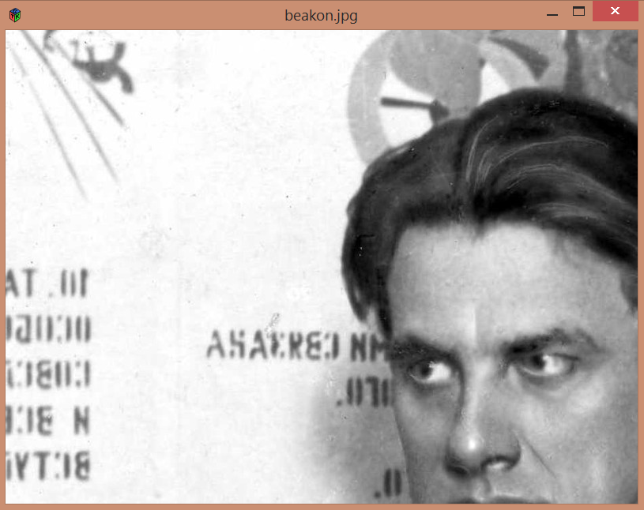
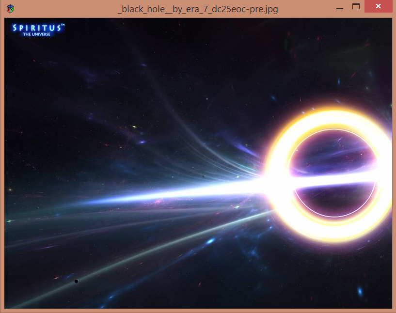
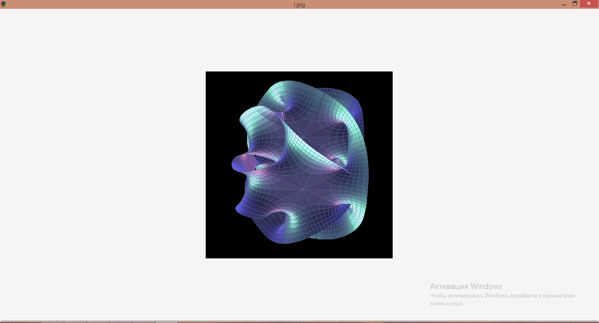
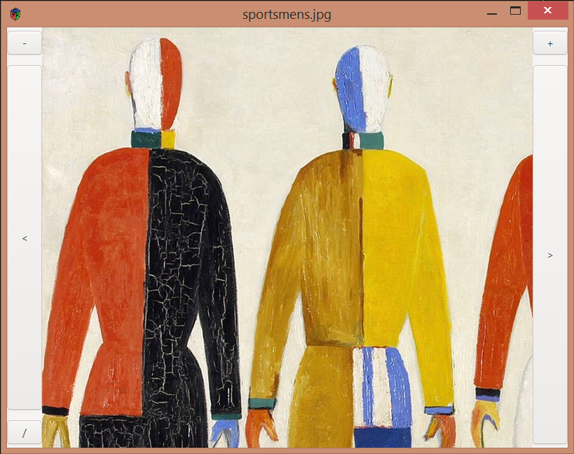

# siv -- simple image viewer
## siv is a simple, customizable image viewer

## features
+ standard flipping, zooming in
+ interface setting
+ interaction with the command line, the ability to "throw" the image into the program

## customization
The settings are read from the `~/.sivrc file`, where each line looks like this:

```
option_name=option_value
```

List of options:
+ `prev-button` -- configures the presence of the previous image button
  + `t` -- display
  + `f` -- hide
+ `next-button` -- configures the presence of the next image button
  + `t` -- display
  + `f` -- hide
+ `zoom+-button` --  configures the presence of the zoom+ button
  + `t` -- display
  + `f` -- hide
+ `zoom--button` -- configures the presence of the zoom- button
  + `t` -- display
  + `f` -- hide
+ `shell-button` -- configures the presence of the `/` button  
  + `t` -- display
  + `f` -- hide
+ `zoom-index` -- sets the value by which the image increases / decreases  

## hotkeys
Also, in addition to buttons, there are hotkeys:

+ `→` -- next image
+ `←` -- previous image
+ `+` -- zoom image
+ `-` -- thumbnail image
+ `/` -- open the "send image" dialog

## sample of the `.sivrc`
```
prev-button=f
next-button=f
zoom+-button=f
zoom--button=f
shell-button=f

zoom-index=50
```
This will lead to this result:



## screenshots



